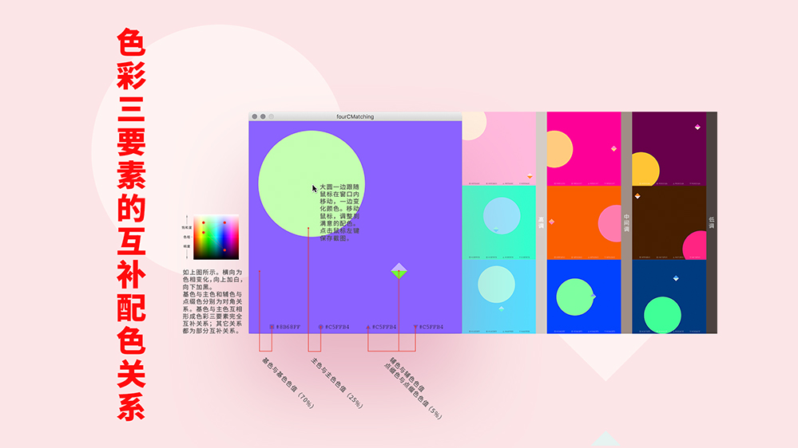

# Complementary color matcher

A color matcher for complementary colors.

## Using instruction 

- There are four colors on the panel, including: basic color, main color, auxiliary color and accent color.
- The four colors are represented by different shapes respectively.
- The four colors are complementary in relation to the three elements of color.
- Move the mouse horizontally to change the hue of the color, and move the mouse vertically to change the brightness and saturation of the color.

## Techstacks

- Processing

Hope you enjoy this color matcher 🤩
